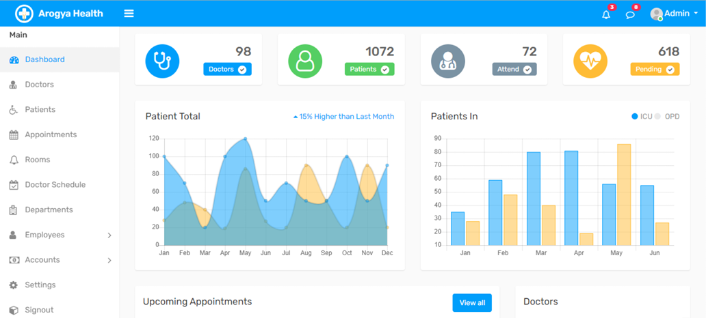

# Arogya Health Care Hospital Management System

## Project Overview

The Arogya Health Care Hospital Management System (HMS) is designed to replace the hospital's manual system for managing critical information. The system aims to streamline and centralize data management, ensuring accuracy and efficiency in handling patient, staff, and operational details.

  

## Features

- **Patient Information**: Manage personal and medical history of patients.
- **Room Availability**: Track and manage room and ward scheduling.
- **Staff Scheduling**: Schedule staff shifts and manage their details.
- **Operating Room Scheduling**: Organize and manage operating theater schedules.
- **Patient Invoices**: Generate and manage patient invoices.

## Technologies Used

- **Language**: PHP
- **Database**: MySQL
- **Server**: XAMPP
- **IDE**: VSCode

## Getting Started

1. Clone the repository: `git clone https://github.com/Nava-stack/arogya-health-care-hospital-php.git`
2. Set up XAMPP and start Apache and MySQL servers.
3. Import the database schema using the provided SQL file into MySQL.
4. Configure the database connection settings in `config.php`.
5. Access the application through `http://localhost/your-project-folder/` in your web browser.

## License

This project is licensed under the MIT License - see the [LICENSE](LICENSE) file for details.
